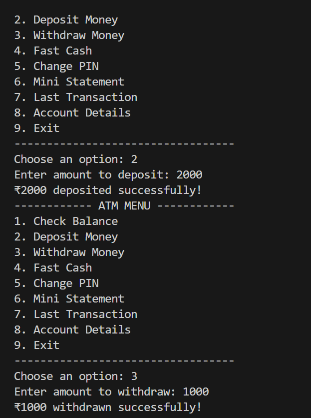
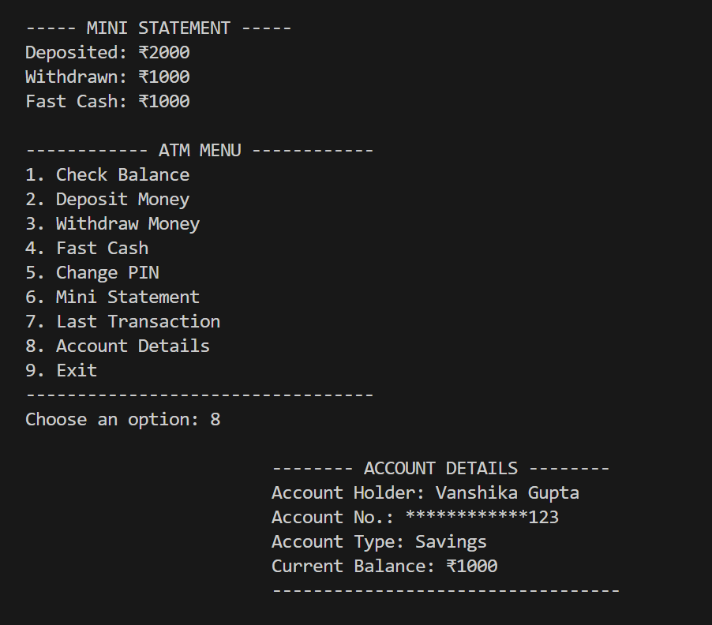

**🏦 ATM Simulator (Python)**

**Axcentra Internship – Week 1 Project**

A simple and modular ATM Simulator developed as part of my Week 1 internship task at Axcentra.
This project focuses on building a clean, menu-driven application using Python while practicing foundational programming concepts.

**⭐ Features**

🔐 PIN-based login system

💰 Check Balance

➕ Deposit Money

➖ Withdraw Money

⚡ Fast Cash (₹500 / ₹1000 / ₹2000)

🧾 Mini Statement (last 5 transactions)

🔄 Last Transaction

🔑 PIN Change Option

👤 Account Details Section

🧩 Function-based Modular Code Structure

📂 **Project Structure**
ATM-Simulator/
│
├── atm.py          # Main program file
├── README.md       # Documentation
└── images/         # Program screenshots

**📸 Screenshots**

### 🔐 Login Screen

### 🏦 ATM Menu

### 💬 Sample Output

🎯 **Learning Outcomes**

Writing menu-driven applications

Using loops & conditional logic effectively

Creating modular programs using functions

Handling user inputs

Simulating real-world logic (ATM operations)

🏢**Internship Information**

This project is part of my **Week 1 assignment** during my internship at **Axcentra**, created to practice Python fundamentals and problem-solving skills.

⭐ **Support**

If you like this project, please consider giving it a ⭐ on GitHub!
